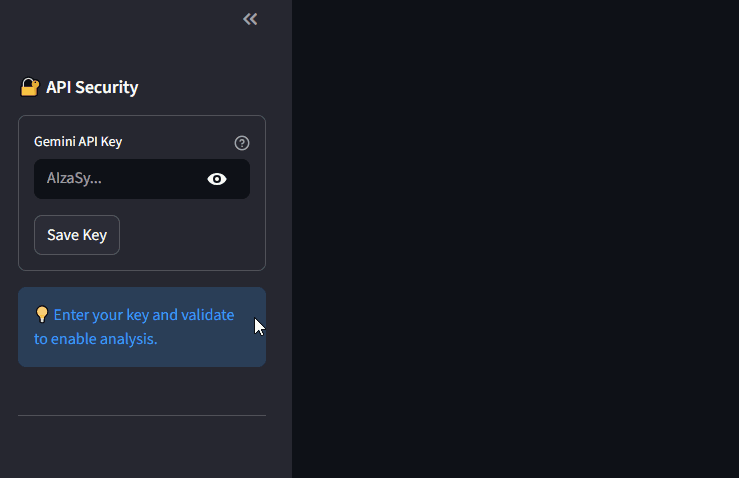
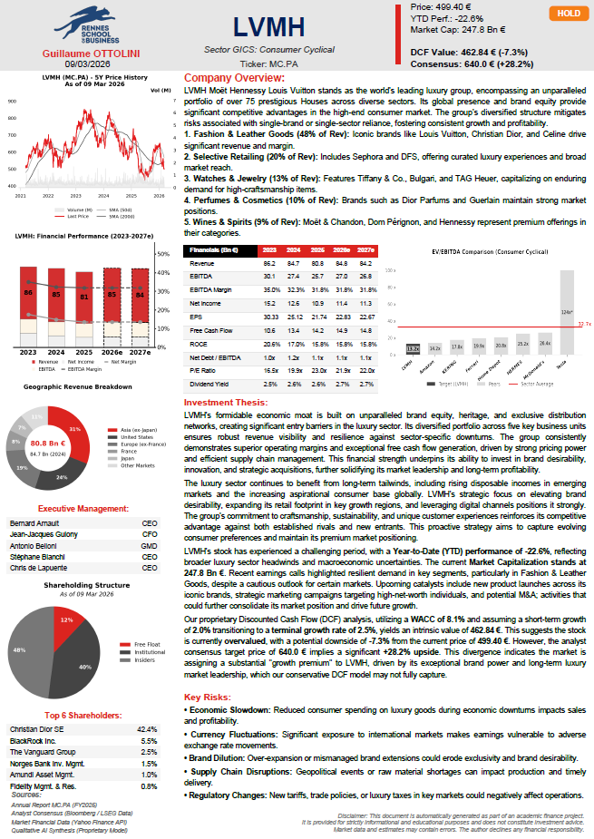
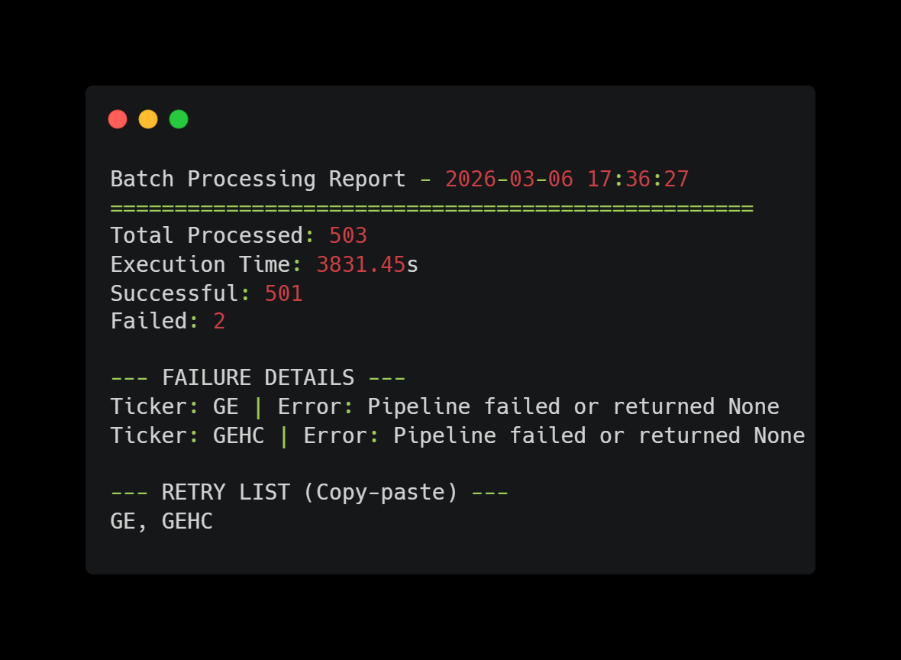
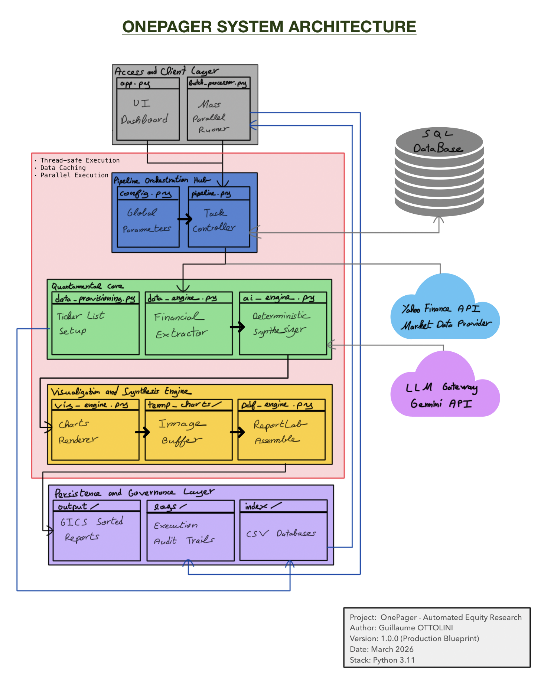

  

# OnePager: Institutional Equity Research Automation

> **Author:** Guillaume OTTOLINI  
> **Concept:** A high-throughput, quantamental pipeline designed to bridge the gap between raw market data and professional-grade investment thesis generation.  
> 
> 🖥️ **Live Interactive Terminal** > **[👉 Access the OnePager Live Demo](https://onepager-automation.streamlit.app)** > *Required: Personal Gemini API Key | Access Code: `RSB2026`*. *Note: To protect proprietary valuation models, the live application simulates the pipeline orchestration and outputs a placeholder PDF. Please see the `examples/` directory for actual generated reports.*

### 🔗 Quick Navigation

| [🚀 Live Demo](https://onepager-automation.streamlit.app) | [🏗️ Architecture (PDF)](assets/OnePager_System_Architecture_V1.pdf) | [📄 Sample Report (PDF)](examples/OnePager_LVMH.pdf) | [👤 LinkedIn](https://www.linkedin.com/in/guillaume-ottolini/) |
| :--- | :--- | :--- | :--- |

---

## 🎥 System Demonstration
The GIF below demonstrates the 30-second workflow: 
1. **Secure API Ingestion** (User-provided Gemini Key).
2. **Real-time Ticker Discovery** (Global Benchmark Search).
3. **Automated Pipeline Execution** (Quant Modeling -> AI Synthesis -> PDF Compilation).

---

## 🔒 Repository Notice & Scalability
> **Please Note:** To protect the proprietary logic, algorithmic guardrails, and AI sanitization loops designed for this pipeline, this repository serves as a **functional showcase**. The full backend source code (Data Engines, Mutex Orchestration, Architecture) is kept in a private repository and is available for institutional review or technical recruitment rounds upon request. 

---

## 📄 Sample Output: The Institutional OnePager
*Automated PDF rendering generated in under 30 seconds. Features dynamic typography scaling, dual-axis financial charting, and deterministic AI synthesis.*

  

  <i>(Click the image above to view the full, high-resolution A4 PDF)</i>

---

## ⚡ Massive Batch Processing & Stress Testing
While the public Streamlit UI is designed for single-ticker lookups, the private backend is engineered for high-frequency parallel execution.

* **S&P 500 Benchmark:** An end-to-end stress test generating complete PDF reports (Data ingestion, DCF valuation, AI synthesis, and Vector rendering) for the entire S&P 500 executed in **3,831 seconds (~7.6 seconds per equity)** on standard, resource-constrained hardware (2017 quad-core architecture).
* **99.6% First-Pass Success Rate:** Successfully processed 501/503 tickers. The system correctly caught and logged fundamental data anomalies (e.g., historical data gaps from $GE and $GEHC corporate spin-offs) without crashing the main execution thread.
* **Resiliency & "Anti-Crash" Systems:** Implements strict fallback loops, dynamic request caching, and API rate-limit firewalls to ensure the pipeline remains unbroken during massive batch runs.
* **Thread Safety:** Leverages `concurrent.futures` and global Mutex locking to prevent memory leaks or data overlapping between different equities in concurrent environments.

### Execution Logs (S&P 500 Run)

---

## 📌 Project Vision

The **OnePager Pipeline** is a specialized financial engineering ecosystem that automates the entire lifecycle of equity research. 

Going far beyond simple data extraction, this architecture orchestrates financial data scraping, Discounted Cash Flow (DCF) modeling, AI-driven qualitative synthesis, dynamic chart generation, and algorithmic PDF compilation. It operates as a massive **Quantamental Scanner**, capable of analyzing and generating professional reports for hundreds of global equities in minutes.

---

## ⚙️ Core System Capabilities (The Architecture)

The backend is strictly decoupled into specialized "Engines" to ensure scalability and maximum performance:

  

  <i>(Click the image above to view the full, high-resolution A4 PDF)</i>

### 1. The Quantitative Data Engine
* **Dynamic Valuation Modeling:** Implements a proprietary multi-stage intrinsic valuation logic with real-time macroeconomic anchoring via live 10-Year Treasury yields (`^TNX`).
* **Algorithmic Growth Cross-Check:** Validates revenue trajectories against earnings momentum. If historical anomalies are detected, it automatically blends a conservative proxy to prevent broken DCF outputs.
* **Cross-Asset Normalization:** Automated reconciliation of reporting vs. trading currencies (e.g., $USD/EUR$, $EUR/JPY$) and capital structure reconstruction for global ADRs.
* **Open-Source Data Sanitization:** Dynamic parsing algorithms designed to clean, structure, and standardize heterogeneous public financial feeds. Automatically handles missing values, unit mismatches, and fiscal year misalignments prior to DCF ingestion.
* **Risk-Aware Guardrails:** Features proprietary non-linear growth decay algorithms and sector-specific WACC floor/cap calibrations to ensure valuation realism across 11 GICS sectors.

### 2. The Qualitative AI Synthesis
* **Deterministic Data Grounding:** Completely mitigates LLM hallucination by forcing the Generative AI (Gemini 2.5 Flash) to ingest and justify its thesis using the hard math calculated by the quantitative engine.
* **The "Golden Rule" Logic:** Hardcoded institutional directives that teach the AI to weigh fundamental overvaluation against market momentum and corporate "moat" premiums.
* **Defensive JSON Sanitization:** Features a "Shareholder Antivirus" that parses and standardizes unpredictable AI data structures into strict, layout-ready formats.

### 3. Algorithmic Document Engineering
* **Vector Typesetting:** Powered by a custom **ReportLab** implementation featuring an iterative execution loop that calculates text density and dynamically scales font sizes/leading to guarantee perfect A4 boundary adherence.
* **High-DPI Financial Visualization:** Thread-safe rendering of dual-axis performance charts and peer-group benchmarking with automated outlier management (visually clipping extremes while retaining true data labels).

### 4. Dual-Layer Data Governance & Orchestration
To optimize latency and minimize API overhead, the pipeline implements a high-efficiency **Multi-Level Caching Architecture**:

* **L1 Cache (Volatile):** Leveraging Streamlit’s memory-based caching for instantaneous UI reactivity during active sessions.
* **L2 Cache (Persistent):** A structured **SQLite Analytical Warehouse** that archives analytical snapshots.
* **JSON Object Serialization:** Utilizes binary-to-text JSON serialization to store high-dimensional AI payloads (management teams, geographic breakdowns), ensuring 100% document consistency without redundant LLM calls.
* **Differential TTL (Time-To-Live) Policy:** 
    * **Market Data:** 24h refresh cycle for price volatility.
    * **AI Synthesis:** 7-day snapshot retention for qualitative consistency.
    * **Financial Statements:** 90-day retention aligned with quarterly reporting cycles.
  
---

## 📂 Public Repository Structure

    OnePager-Public/
    ├── assets/                   # 🖼️ Visual branding, main architecture, performance logs...
    ├── examples/                 # 📄 High-resolution generated PDFs (LVMH, NVDA, etc.)
    ├── app_demo.py               # 🖥️ UI structural preview (Frontend architecture only)
    ├── packages.txt              # 🐧 OS-level dependencies (Fonts & PDF rendering)
    ├── requirements.txt          # 🐍 Python package dependencies
    ├── LICENSE.md                # ⚖️ Proprietary & Intellectual Property Notice
    └── README.md                 # 📖 Project documentation and roadmap

---

## 🛠️ Comprehensive Tech Stack

The pipeline relies on a robust matrix of modern Python libraries, optimized for institutional finance:

* **Quantitative Data & Matrix Math:** `pandas`, `numpy`, `yfinance`
* **Optimization & Execution:** `concurrent.futures` (Parallel dispatch), `threading` (Global Mutex locking for API thread safety), `sqlite3` (L2 Persistent Archive), `json` (Payload Serialization).
* **Artificial Intelligence:** `google-genai` (Structured JSON generation)
* **Visualization & Document Engineering:** `matplotlib` (Headless 'Agg' backend), `seaborn`, `ReportLab` (Platypus layout engine)
* **Frontend:** `streamlit` (L1 Memory-based Caching), `streamlit-searchbox`

---

## ⚠️ Technical Limitations & Methodology Notes

While **OnePager** is engineered for high-performance batch processing, it is currently subject to the following technical constraints inherent to automated fundamental analysis:

* **Data Source Integrity:** The pipeline currently relies on public feeds (`yfinance`). While resilient, these sources lack the institutional-grade SLA and point-in-time accuracy provided by professional terminals (e.g., Bloomberg, Refinitiv).
* **Capital Structure Simplification:** The valuation engine assumes a standard capital structure. It does not currently account for complex dual-class share rights, deep-in-the-money dilutive instruments, or complex minority interest reconciliations.
* **Deterministic Valuation:** The current DCF model is deterministic. Financial modeling is highly sensitive to $WACC$ and Terminal Growth ($g$) assumptions. Therefore, outputs should be viewed as a baseline valuation rather than an absolute price target.
* **Linear Forecasting & Operating Leverage:** Projected financial metrics (e.g., $EBITDA$ Margin, $ROCE$) are currently modeled as constants based on trailing historical averages or the last reported fiscal year. The system does not yet dynamically account for non-linear operating leverage, economies of scale, or margin compression/expansion during periods of significant revenue volatility. Advanced stochastic forecasting and mean-reversion logic are slated for v2.0.
* **Sectoral Specificity:** The core engine uses a standard FCF-based valuation. It is currently optimized for Industrial and Tech sectors and may require custom logic for Financials (Banks/Insurance) or Real Estate Investment Trusts (REITs).
* **AI Synthesis Guardrails:** While the "Golden Rule" logic mitigates hallucinations, the AI synthesis remains a qualitative layer. All generated insights must be cross-referenced with the raw quantitative data provided in the report.

---

## 🚀 The Quantamental Roadmap

To maintain academic and professional rigor, the system is continually evolving.

**v2.0 - Infrastructure & AI Independence:**
* ✅ **Dual-Layer Persistence:** [COMPLETED] Implementation of the SQLite L2 Cache and JSON Payload serialization.
* 🔄 **Stochastic Modeling:** Implementation of Monte Carlo simulations to generate probability distributions for the DCF intrinsic value.
* 📡 **Institutional API Migration:** Transitioning the data ingestion layer to institutional endpoints (e.g., Bloomberg B-Pipe, FactSet) for higher fidelity fundamental data.
* 🔒 **Local LLM Deployment (Privacy-First):** Migration to locally-hosted open-weights models (e.g., Llama 3 / Mistral) to guarantee zero data leakage, meeting strict institutional compliance for proprietary screening.

**v3.0 - Machine Learning Layer:**
* 📊 **Unsupervised Peer-Group Discovery:** Implementation of K-Means clustering to dynamically identify comparable companies based on high-dimensional fundamental proximity rather than static GICS sector codes.
* 🚨 **Fundamental Anomaly Detection:** Deployment of Isolation Forest models to flag statistically significant pricing dislocations.
* 🎭 **NLP Sentiment Quantification:** Integration of specialized financial transformers (e.g., FinBERT) to convert unstructured news flow into normalized "Sentiment Scores" for cross-asset ranking.
* ⚖️ **Portfolio Optimization Engine:** Transitioning from single-stock analysis to fund allocation by integrating Mean-Variance Optimization (Markowitz).

---

## 📧 Contact & Technical Inquiries

Currently pursuing an M1 in Finance at Rennes School of Business with an exchange at UC3M, I am seeking a **6-month internship in Market Finance** (Equity Research, Sales & Trading...) starting in **July 2026**. 

My approach is **Quantamental**: I bridge traditional financial modeling with **Python-driven automation**. By developing data pipelines and integrating AI, I build tools to automate fundamental analysis, scale investment research, and **optimize Front-Office workflows** to support Alpha generation.

For a live demonstration of the pipeline, access to the private backend repository, or professional inquiries, please reach out:

* **LinkedIn:** [Guillaume OTTOLINI](https://www.linkedin.com/in/guillaume-ottolini/)
* **Email:** [guillaume.ottolini@rennes-sb.com](mailto:guillaume.ottolini@rennes-sb.com)